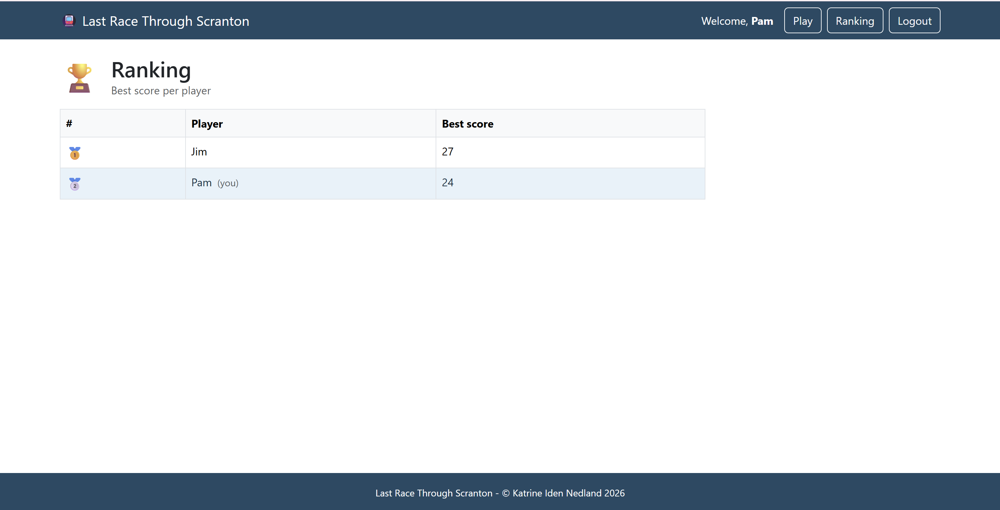
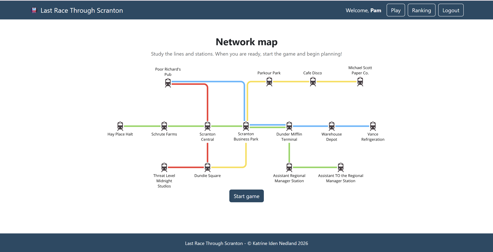
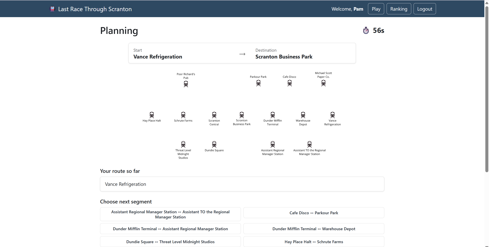
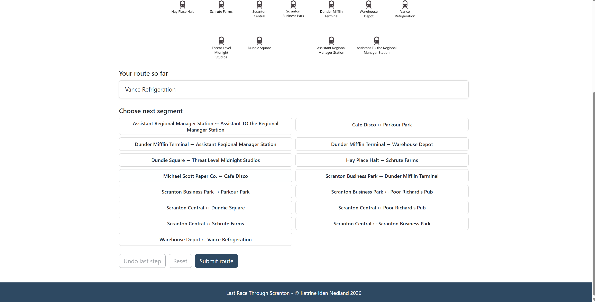

# Exam #1: "Last Race"
## Student: s362911 NEDLAND KATRINE IDEN 

## React Client Application Routes

- Route `/`: home page with the game instructions. Public — anonymous users see only the instructions (no map); logged-in users also get a "Start game" button.
- Route `/login`: login form (email + password). Public.
- Route `/game`: the game itself (Setup → Planning → Execution → Result, handled with internal phase state). Logged-in users only.
- Route `/ranking`: ranking table showing the best score per player. Logged-in users only.
- Route `*`: 404 Not Found page for any unmatched URL.

## API Server

- POST `/api/sessions`
  - Logs a user in. Request body: `{ email, password }`.
  - Response: the user object `{ id, email, name }`. `401` on wrong credentials.
- GET `/api/sessions/current`
  - Returns the currently logged-in user (used to restore the session on load).
  - Response: `{ id, email, name }`, or `401` if not authenticated.
- DELETE `/api/sessions/current`
  - Logs the current user out. No parameters.
  - Response: empty body, status `200`.
- GET `/api/network/map`
  - Full network map with lines, for the Setup phase. Authenticated.
  - Response: array of lines `{ id, name, color, stations: [{ id, name, position }] }`.
- GET `/api/network/stations`
  - Station names only, for the Planning phase. Authenticated.
  - Response: array of `{ id, name }`.
- GET `/api/network/segments`
  - All segments (connected station pairs), no line information, for the Planning phase. Authenticated.
  - Response: array of `{ aId, aName, bId, bName }`.
- POST `/api/games`
  - Creates a new game; the server randomly assigns start + destination (distance ≥ 3). Authenticated. No body.
  - Response (`201`): `{ gameId, start: { id, name }, destination: { id, name } }`.
- GET `/api/games/:id`
  - Fetches a single game's state, scoped to the owning user. Param: `id` (integer).
  - Response: the game row; includes a `steps` array if the game is completed. `404` if not found.
- POST `/api/games/:id/submit`
  - Validates and runs the submitted route server-side, then completes the game. Param: `id` (integer). Body: `{ route: [{ fromStationId, toStationId }] }`.
  - Response: valid route → `{ isValid: true, finalScore, steps: [...] }`; invalid/incomplete → `{ isValid: false, finalScore: 0 }`. `404` if not found, `409` if already completed, `422` on validation error.
- GET `/api/ranking`
  - Best score per player (only users with completed games). Authenticated.
  - Response: array of `{ userId, name, bestScore }`, ordered by best score descending.

## Database Tables

- Table `users` - registered users; passwords stored as a scrypt hash with a per-user salt.
- Table `stations` - the metro stations (`id`, `name`).
- Table `lines` - the metro lines (`id`, `name`, `color`).
- Table `lineStations` - junction table linking stations to lines with a `position` (ordering). A station on more than one line is an interchange. Segments are derived from this table (no separate segments table).
- Table `events` - predefined random events, each with a `description` and an `effect` between -4 and +4.
- Table `games` - one row per game: user, start/destination station, `finalScore`, `status`, `isValid`, `createdAt`.
- Table `gameSteps` - the submitted route, one row per step (segment), with its assigned `eventId` and the running `remainingCoins`.

## Main React Components

- `App` (in `App.jsx`): defines the routes and the `ProtectedRoute` wrapper that redirects anonymous users away from logged-in-only pages.
- `PageLayout` (in `components/PageLayout.jsx`): page shell with Header, Footer, and an `Outlet` for the routed content.
- `HomePage` (in `pages/HomePage.jsx`): landing page with the game rules and the start/login button.
- `LoginPage` (in `pages/LoginPage.jsx`): login form with client-side validation.
- `GamePage` (in `pages/GamePage.jsx`): pure state machine orchestrating the four game phases and holding the shared game state.
- `SetupPhase` (in `components/SetupPhase.jsx`): shows the full network map and starts the game.
- `PlanningPhase` (in `components/PlanningPhase.jsx`): build a route from the segment list within 90 seconds; auto-submits on timeout.
- `ExecutionPhase` (in `components/ExecutionPhase.jsx`): replays a valid route one step at a time with the running coin total.
- `ResultPhase` (in `components/ResultPhase.jsx`): shows the final score and a "Play again" option.
- `RankingPage` (in `pages/RankingPage.jsx`): table of each player's best score.
- `Timer` (in `components/Timer.jsx`): wall-clock countdown that calls `onExpire` when time runs out.
- `AuthContext` (in `contexts/AuthContext.jsx`): provides the `useAuth()` hook with the current user and login/logout.

(only _main_ components, minor ones may be skipped)

## Screenshot

## Users Credentials

- pam@dm.com, password — has completed games
- jim@dm.com, password — has completed games
- dwight@dm.com, password — registered but no completed games

## Use of AI Tools
I used Claude (Anthropic) during this project for:
- helping understand the assignment and breaking it down into subtasks
- discussing architectural decisions 
- helping create the seed data
- verifying that the code is compliant with the exam requirements
- creating comments
- generating example code (the first API method, to have something to work from)
- debugging and code verification
- help with the more complex/difficult parts of the code

I reviewed all code created with AI and made sure I understood it. I verified all output by testing each API endpoint manually with a REST client, playing through every game phase while watching the browser console, correcting mistakes I found.
